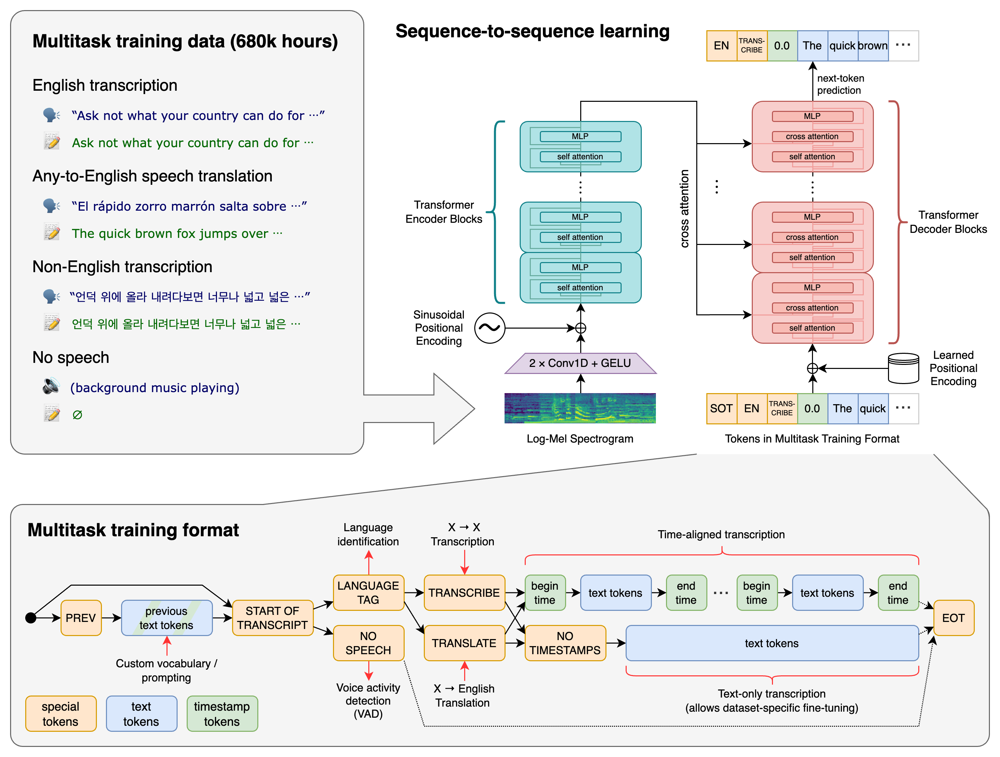

# Whisper Dart

**A local, privacy-first desktop transcription app** built on top of [OpenAI Whisper](https://github.com/openai/whisper) and [faster-whisper](https://github.com/SYSTRAN/faster-whisper). Audio never leaves your machine — everything runs entirely offline.

[[Paper]](https://arxiv.org/abs/2212.04356) · [[Model Card]](model-card.md) · [[Changelog]](CHANGELOG.md)

---

## Screenshot


> *Full three-panel layout: transcript library (left), main transcription workspace (centre), settings panel (right).*

---

## Features

- **Fully offline** — no cloud API, no data leaving your device
- **99 languages** — auto-detected or manually selected
- **Multiple output formats** — TXT, SRT, VTT, TSV, JSON, or all at once
- **Live progress** — real-time segment timeline and word-level timestamps
- **Transcript library** — search, sort, tag, and organise recordings into projects
- **In-browser recording** — capture audio directly without leaving the app
- **Persistent settings** — every option saves as your personal default for next time
- **Resizable sidebar** — drag to your preferred width; survives restarts

---

## UI Layout

The interface is split into three panels.

### Left — Transcript Library

The sidebar lists all your past transcriptions. Each row shows the title, project, date, and any colour-coded tags you've applied.

| Control | What it does |
| --- | --- |
| **Search box** | Filters by title, project name, or tag in real time |
| **Sort buttons** | Sort by Date / Name / Project; toggle ascending ↕ descending |
| **⋯ kebab menu** | Per-transcript actions: rename, move to project, add tags, delete |
| **Project picker** | Assign a transcript to a named project or Inbox |
| **+ New Project** | Creates a new project folder directly from the sidebar |

The sidebar width is draggable and persists between sessions.

### Centre — Transcription Workspace

The main panel is where you start and monitor transcriptions.

| Element | What it does |
| --- | --- |
| **Title bar** | Editable transcript title; saves on blur |
| **Audio panel** | Upload an audio/video file (mp4, mov, wav, mp3, …) or record live |
| **Microphone selector** | Pick the input device for in-browser recording |
| **Transcribe / Cancel** | Starts or stops the active transcription |
| **Progress bar** | Shows completion percentage in real time |
| **Status line** | Displays detected language, segment count, and current status |
| **Full Transcript** | Clean text output; copy button in the top-right corner |
| **Live Output** | Scrollable raw segment stream as the model processes audio |
| **Segment Timeline** | Collapsible view of every timestamped segment |

### Right — Settings Panel

Toggled with the **⚙️** button. All settings auto-save as your global defaults for new transcriptions and can be overridden per transcript.

---

## Configuration Reference

### Core Settings

| Setting | Options | Description |
| --- | --- | --- |
| **Save To** | Path | Directory where output files are written. Defaults to Desktop. |
| **Model** | `turbo`, `large-v3-turbo`, `large-v3`, `large-v2`, `large-v1`, `medium`, `medium.en`, `small`, `small.en`, `base`, `base.en`, `tiny`, `tiny.en` | Whisper model to use. See model table below. |
| **Language** | Auto-detect + 99 languages | Audio language. Auto-detect reads the first 30 s to identify it. |
| **Task** | `transcribe` · `translate` | Transcribe keeps the source language; translate outputs English. `turbo` supports transcribe only. |
| **Output Format** | `all`, `txt`, `srt`, `vtt`, `tsv`, `json` | File format(s) written to the Save To folder. `all` writes every format. |

### Advanced Options

| Setting | Default | Description |
| --- | --- | --- |
| **Word-level Timestamps** | off | Attaches a timestamp to every individual word, not just per segment. |
| **Condition on Previous Text** | on | Feeds prior output as context into the next window — smoother flow, but can propagate errors. |
| **Temperature** | 0 | Sampling randomness. `0` = deterministic (greedy). Higher values increase creativity at the cost of stability. |
| **Beam Size** | 5 | Search width for beam-search decoding. Higher = more accurate, slower. |
| **No-speech Threshold** | 0.6 | Silence probability above which a segment is dropped. Higher = keep more borderline segments. |
| **Initial Prompt** | *(empty)* | Text hint to prime the model: custom vocabulary, proper nouns, spelling conventions. |
| **Compute Type** | `int8` | Numeric precision. `int8` = fastest; `float32` = most accurate, slower; `int8_float32` = balanced. |
| **Best Of** | 5 | Number of sampling candidates when Temperature > 0. |
| **VAD Filter** | off | Voice Activity Detection — skips silent segments before sending to Whisper. Faster, fewer hallucinations. |
| **Compression Ratio Threshold** | 2.4 | Segments with a compression ratio above this are discarded as likely gibberish. |
| **Logprob Threshold** | −1.0 | Segments with average log-probability below this threshold are discarded as low-confidence. |

---

## Model Overview

### Available Models

Whisper is available in six sizes. English-only variants (`.en`) trade multilingual capability for higher accuracy on English audio.

| Size | Parameters | English-only | Multilingual | VRAM | Relative speed |
| :---: | :---: | :---: | :---: | :---: | :---: |
| tiny | 39 M | `tiny.en` | `tiny` | ~1 GB | ~10× |
| base | 74 M | `base.en` | `base` | ~1 GB | ~7× |
| small | 244 M | `small.en` | `small` | ~2 GB | ~4× |
| medium | 769 M | `medium.en` | `medium` | ~5 GB | ~2× |
| large | 1 550 M | — | `large-v1/v2/v3` | ~10 GB | 1× |
| turbo | 809 M | — | `turbo` / `large-v3-turbo` | ~6 GB | ~8× |

**Recommended starting point:** `large-v3-turbo` — it combines large-model accuracy with near-turbo inference speed.

### How Whisper Works

Whisper is a Transformer sequence-to-sequence model trained on 680,000 hours of diverse, multilingual audio collected from the internet. Of this, roughly 438,000 hours are English audio paired with English transcripts; 126,000 hours are non-English audio paired with English translations; and 117,000 hours are non-English audio paired with transcripts in the source language, spanning 98 languages.



The model processes audio in 30-second windows, converting each into a log-Mel spectrogram before encoding it. A decoder then autoregressively predicts the output tokens, conditioned on a sequence of special task tokens. These tokens encode whether the model should transcribe, translate, detect language, or flag voice activity — allowing a single model to handle all four tasks without architectural changes.

Training uses weak supervision at scale: transcripts are sourced from the web and are not manually verified, which makes the model robust to real-world audio conditions (background noise, accents, domain-specific vocabulary) but also susceptible to occasional hallucinations — plausible-sounding text not actually present in the audio. The VAD filter and threshold settings in Whisper Dart help mitigate this.

### Capabilities

- **Multilingual transcription** across 99 languages
- **Speech-to-English translation** (all multilingual models)
- **Automatic language identification** from the first 30 seconds of audio
- **Word-level timestamps** with alignment to audio frames
- **Robustness to accents, background noise, and technical vocabulary**

### Limitations

- Transcription accuracy is directly correlated with the amount of training data available for each language; low-resource languages exhibit higher word error rates
- The sequence-to-sequence architecture can produce hallucinated text, particularly in silent or low-speech segments
- The `turbo` model does not support translation tasks
- Speaker diarisation and real-time streaming are not supported out of the box

Performance benchmarks by language (WER / CER on Common Voice 15 and Fleurs) are documented in the [paper](https://arxiv.org/abs/2212.04356).

---

## Setup

### Requirements

- Python 3.9 – 3.12
- [`ffmpeg`](https://ffmpeg.org/) on your `PATH`

```bash
# macOS
brew install ffmpeg

# Ubuntu / Debian
sudo apt install ffmpeg

# Windows (Chocolatey)
choco install ffmpeg
```

### Install

```bash
git clone https://github.com/MarianLojka/whisper-dart.git
cd whisper-dart

python -m venv .venv
source .venv/bin/activate        # Windows: .venv\Scripts\activate

pip install -r requirements.txt
pip install faster-whisper gradio
```

### Run

```bash
gradio ui/whisper_app.py
```

Or without hot-reload:

```bash
python -m ui.whisper_app
```

The app opens at `http://localhost:7860` in your browser.

---

## Python API (headless)

The underlying Whisper library can also be used directly without the UI:

```python
import whisper

model = whisper.load_model("turbo")
result = model.transcribe("audio.mp3")
print(result["text"])
```

For lower-level access (language detection, decoding options):

```python
import whisper

model = whisper.load_model("turbo")

audio = whisper.load_audio("audio.mp3")
audio = whisper.pad_or_trim(audio)

mel = whisper.log_mel_spectrogram(audio, n_mels=model.dims.n_mels).to(model.device)

_, probs = model.detect_language(mel)
print(f"Detected language: {max(probs, key=probs.get)}")

options = whisper.DecodingOptions()
result = whisper.decode(model, mel, options)
print(result.text)
```

---

## License

Whisper's model weights and code are released under the **MIT License**. See [LICENSE](https://github.com/openai/whisper/blob/main/LICENSE) for details.

---

*Built by Marian Lojka ®*
